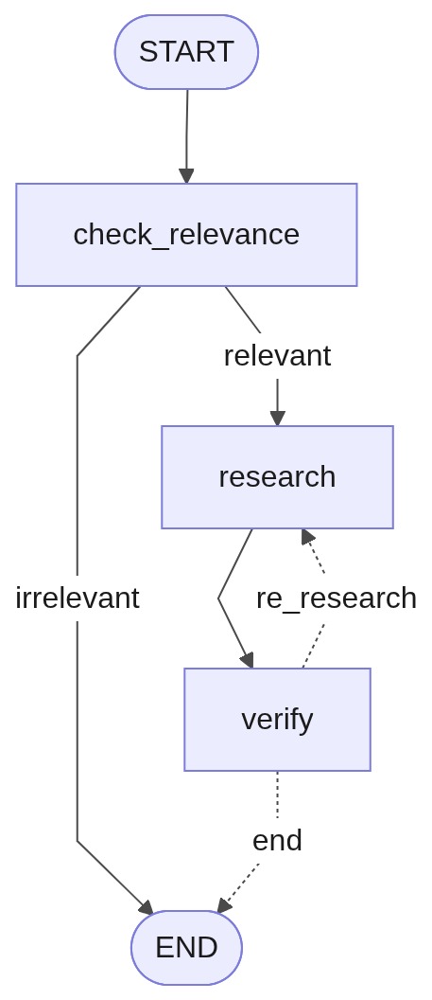

# DocChat

> Sistema multi-agente RAG para análisis de documentos usando LangGraph y OpenRouter.


---

## Descripción

DocChat es un sistema **multi-agente de Retrieval Augmented Generation (RAG)** que permite conversar con tus documentos. Sube un archivo PDF, DOCX, TXT o MD, haz una pregunta, y obtén una respuesta generada por IA respaldada por el contenido del documento.

El sistema utiliza tres agentes especializados que trabajan en secuencia:

1. **Verificador de Relevancia** — Determina si el documento puede responder la pregunta
2. **Agente de Investigación** — Genera una respuesta a partir de los fragmentos relevantes
3. **Agente de Verificación** — Valida la respuesta contra el contenido fuente

## Flujo de Trabajo



| Paso | Agente | Descripción |
|------|--------|-------------|
| 1 | **Verificador de Relevancia** | Clasifica el par documento-pregunta como `CAN_ANSWER`, `PARTIAL` o `NO_MATCH` |
| 2 | **Agente de Investigación** | Recupera fragmentos relevantes y genera una respuesta factual |
| 3 | **Agente de Verificación** | Cruza la respuesta buscando soporte factual, contradicciones y relevancia |
| 4 | **Re-investigación** | Si la verificación falla, el flujo vuelve al paso 2 |

## Arquitectura


## Stack Tecnológico

| Componente | Tecnología |
|------------|------------|
| LLM | DeepSeek v3 (vía OpenRouter) |
| Embeddings | Qwen3 Embedding 8B (vía OpenRouter) |
| Vector Store | ChromaDB (local) |
| Recuperación | Búsqueda híbrida BM25 + Semántica |
| Procesamiento de Documentos | Docling |
| Framework de Agentes | LangGraph |
| Interfaz | Gradio |
| Salida Estructurada | Pydantic |

## Estructura del Proyecto

```
DocChat/
├── app.py                          # Interfaz Gradio y punto de entrada
├── generate_diagram.py             # Generador de diagrama del flujo
├── requirements.txt
├── .env                            # API keys (no se sube al repositorio)
├── agents/
│   ├── models.py                   # Modelos Pydantic (VerificationReport)
│   ├── relevance_checker.py        # Clasificador de relevancia
│   ├── research_agent.py           # Agente de generación de respuestas
│   ├── verification_agent.py       # Agente de validación de respuestas
│   └── workflow.py                 # Orquestación del flujo LangGraph
├── config/
│   ├── constants.py                # Constantes de la aplicación
│   └── settings.py                 # Configuración basada en variables de entorno
├── document_processor/
│   └── file_handler.py             # Parseo y fragmentación de documentos
├── retriever/
│   └── builder.py                  # Construcción del recuperador híbrido
├── diagrama/
│   └── diagram.png                 # Diagrama del flujo de agentes
└── utils/
    └── logging.py                  # Configuración de Loguru
```

## Inicio Rápido

### Requisitos Previos

- Python 3.11+
- Una [API key de OpenRouter](https://openrouter.ai/keys)

### Instalación

```bash
# Clonar el repositorio
git clone https://github.com/tu-usuario/DocChat.git
cd DocChat

# Crear entorno virtual
python -m venv .venv
source .venv/bin/activate  # Linux/Mac
# .venv\Scripts\activate   # Windows

# Instalar dependencias
pip install -r requirements.txt

# Configurar variables de entorno
echo 'OPENROUTER_API_KEY=tu-api-key-aquí' > .env
```

### Ejecución

```bash
python app.py
```

Abrír [http://127.0.0.1:5000](http://127.0.0.1:5000) en tu navegador.

## Configuración

Todas las opciones están en `config/settings.py` y pueden sobreescribirse desde `.env`:

| Variable | Valor por defecto | Descripción |
|----------|-------------------|-------------|
| `OPENROUTER_API_KEY` | — | Obligatoria. Tu API key de OpenRouter |
| `CHAT_MODEL` | `deepseek/deepseek-chat` | Modelo LLM para los agentes |
| `EMBEDDING_MODEL` | `qwen/qwen3-embedding-8b` | Modelo de embeddings |
| `VECTOR_SEARCH_K` | `10` | Cantidad de fragmentos para búsqueda vectorial |
| `CACHE_EXPIRE_DAYS` | `7` | TTL del caché de documentos |

## Formatos Soportados

- `.pdf`
- `.docx`
- `.txt`
- `.md`

## Costo

Usando DeepSeek vía OpenRouter, el costo por consulta es de aproximadamente **$0.0001 USD**.
